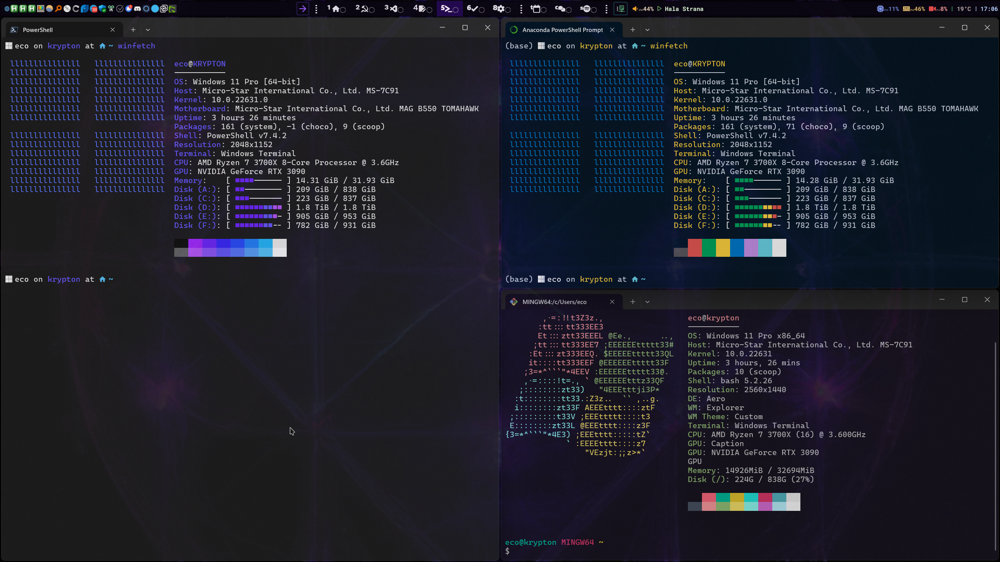

# aaronedev | glazewm config | violet void theme

**glazewm config:**

- <https://github.com/aaronedev/glazewm>

**wallpaper64 config:**

- <https://steamcommunity.com/sharedfiles/filedetails/?id=3188957645>
